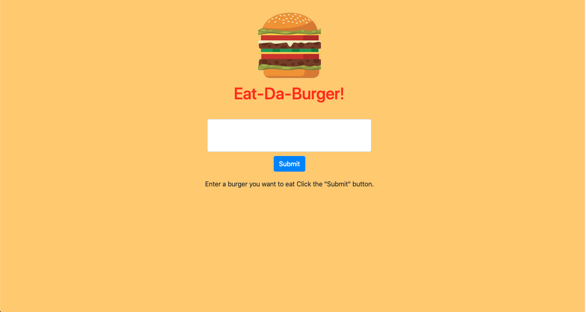
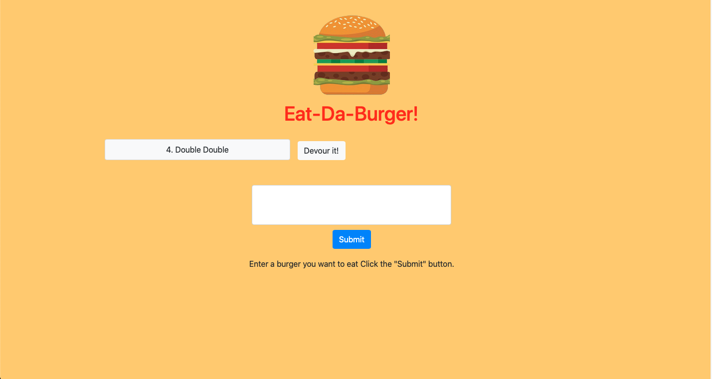
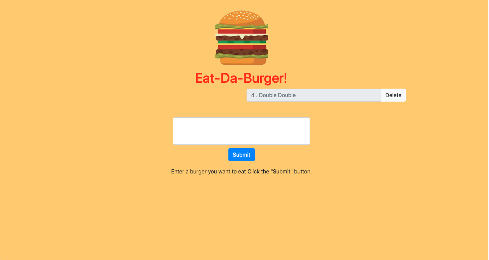

# Eat Da Burger
 
  
---

## Description
Eat-Da-Burger! is a restaurant app that lets users input the names of burgers they'd like to eat

---
## Table of Contents
  
1. [ Description ](#description)
2. [ Visuals ](#visuals)
3. [ Demo](#demo)
4. [ Installation](#installation)
5. [ Usage ](#usage)
6. [ License ](#license)
7. [ Contributing ](#contributing)
8. [ Questions ](#questions)

---

## Visuals

---

## Demo

Checkout the [demo page](https://agile-caverns-20402.herokuapp.com) to see Eat Da Burger in action.

---

## Installation

  
1. Run the following command at the root of your project.

    ``
    npm install
    ``

2. Run the command.

    ``sh
    heroku create
    ``

3. Log in to your [Heroku account](https://id.heroku.com/login).

4. Find your Heroku app’s name in the dashboard. Click on it.

5. Look for the Add-Ons section in your app’s dashboard and type JawsDB in the input field. That should bring up the JawsDB MySQL add-on.

6. Click on JawsDB MySQL and that should should bring up a modal asking you to provision a specific tier plan.

7. Make sure you select the free option, then click the Provision button.

8. You’ll know that Heroku set up your database when a JawsDB entry shows up in under the Add-ons section.

9. Click JawsDB MySQL to bring up the settings to your remote database. You’ll need this information later.

10. Run the command 
  
    ``sh
    git push heroku master.
    ``

11. Now we have to manually create the tables in our JawsDB instance so we can properly connect to it. JawsDB includes certain fields that we must employ in our project. Otherwise, we won’t be able to use the remote database.

12. Open the Graphical User Interface (GUI) software of your choice: Sequel Pro, MySQL Workbench, Valentina Studio or HeidiSQL.

13. Create a connection to the database. In the Host input field, grab the host value from your JawsDB settings page. Use the page’s username and password for your connection, as well. After you enter in all the database credentials, establish the connection. 

14. Once you’re connected to JawsDB, go into its sole database (should be a jumble of characters). You’re going to store the tables you need for your project into this database. Use the schema included in this project you will run the query to install the tables.

6. After you configure your JawsDB database, run the following command.
  
    ``sh
    git push heroku master.
    ``

---

## Usage

1. When the app is running. Type in a burger name and click submit. You should see it appear on the left.

2. Click on the devour button next to the button you want to eat.

3. You will see the burger move to the right/

4. Next delete the burgers you no longer want to keep track of.  
  
---

## License

Copyright (c) 2020, Andrew Crow. (MIT License)

---

## Contributing

We are currently not allowing outside contributors to this project, but check back because things can change.

---

## Questions

If you have questions you can reach me here:
  
Email: andrew@crow.me

GitHub: [Github Profile](https://github.com/crowandrew)

---

